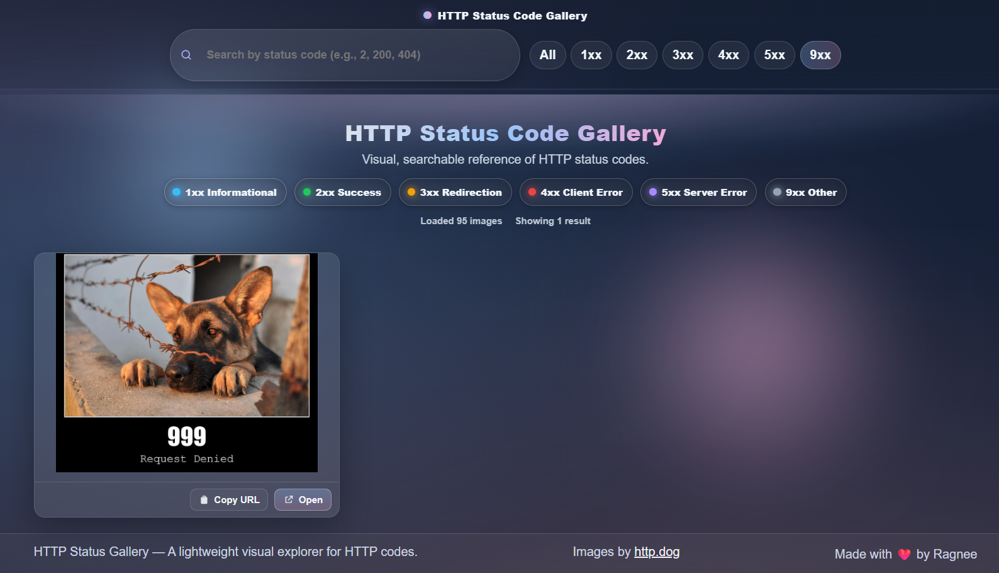

# HTTP Status Code Explorer

Simple app to search, view, and save HTTP status codes.

## Screenshots

<table>
  <tr>
    <td align="center">
       
      HTTP 1xx (Informational)
    </td>
    <td align="center">
        
      HTTP 9xx (Custom)
    </td>
    <td align="center">
       
      HTTP 3xx (Redirection)
    </td>
  </tr>
  <tr>
    <td align="center">
       
      HTTP 4xx (Client Errors)
    </td>
    <td align="center">
       
      HTTP 5xx (Server Errors)
    </td>
    <td align="center">
       
      HTTP 2xx (Success)
    </td>
  </tr>
</table>

## Quick start
- Server: `cd server && npm install && npm start`
- Client: `cd client && npm install && npm start`
